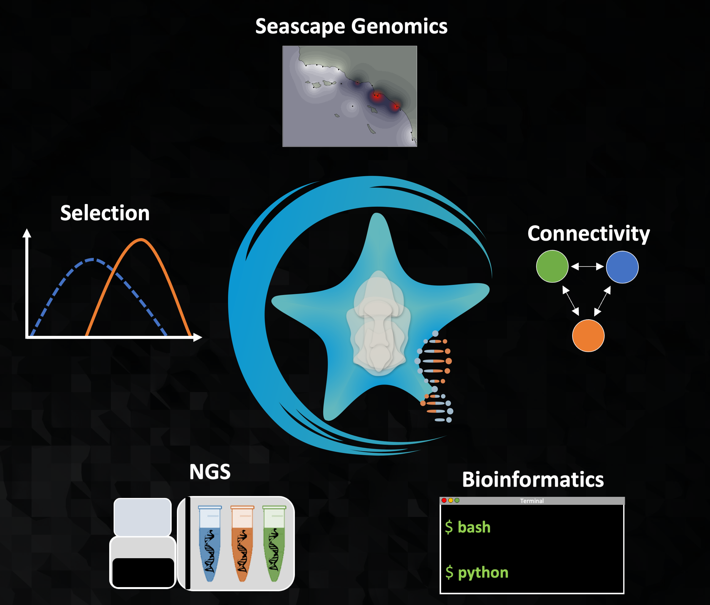

---
# An instance of the Portfolio widget.
# Documentation: https://wowchemy.com/docs/page-builder/
widget: portfolio

# This file represents a page section.
headless: FALSE

# Order that this section appears on the page.
weight: 65

title: Research overview
subtitle: 'Coastal ecosystems face a complex of stressors that span multiple temporal and spatial scales, from long-term global ocean change to localized episodes of coastal acidification, and marine species experience these multiple stressors simultaneously.  Understanding how marine populations will evolve in response to environmental change requires investigating the synergistic impacts of multiple stressors across all life stages.

Our research investigates how natural and anthropogenic processes affect the evolution of marine populations through the lens of larval dispersal.  We combine laboratory multi-stressor larval exposure experiments with genomic surveys of natural populations, analyzing patterns of selection and migration in a geographic context using landscape (or seascape) genomic models.  Our lab also develops laboratory and bioinformatic methods to facilitate the use of next-generation sequencing in non-model species.' 

content:
  # Page type to display. E.g. project.
  page_type: project

  # Default filter index (e.g. 0 corresponds to the first `filter_button` instance below).
  filter_default: 0

  # Filter toolbar (optional).
  # Add or remove as many filters (`filter_button` instances) as you like.
  # To show all items, set `tag` to "*".
  # To filter by a specific tag, set `tag` to an existing tag name.
  # To remove the toolbar, delete the entire `filter_button` block.
  filter_button:
  - name: Next-generation Sequencing
    tag: NGS
  - name: Bioinformatics
    tag: Bioinformatics
  - name: Population Connectivity
    tag: Connectivity
  - name: Selection
    tag: Selection
  - name: Seascape Genomics
    tag: Seascape Genomcis  
        
design:
  # Choose how many columns the section has. Valid values: '1' or '2'.
  columns: '1'

  # Toggle between the various page layout types.
  #   1 = List
  #   2 = Compact
  #   3 = Card
  #   5 = Showcase
  view: 5

  # For Showcase view, flip alternate rows?
  flip_alt_rows: false
---

