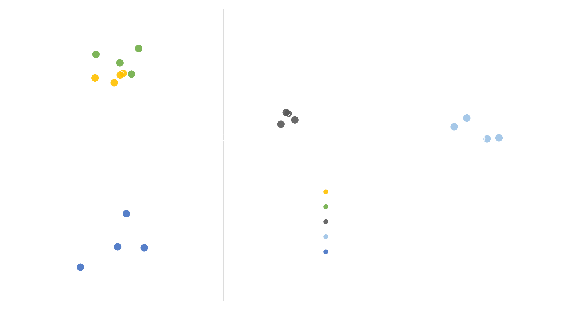

During the summer of 2017, preliminary exposure trials were conducted using larvae from the eastern oyster (Crassostrea virginica).  Wild adult broodstock were collected from Ipswich, MA and Barnstable, MA, and brought into the lab and conditioned for several weeks.  Oysters were spawned via thermal induction, and larvae were kept in ambient, filtered sea water for 16 hours to ensure all embryos had developed to the trochophore larval stage.  After 16 hours, larvae were counted and approximately ~125,000 larvae were transferred to sixteen 1 L glass mesocosms and four replicate 100,000 larvae subsamples were flash frozen.  After acclimation, one of four treatments were randomly assigned to each mesocosm (4 per treatment): CON-Control conditions, CA- Coastal Acidification treatment of ~2800 $\mu$atm pCO2 sea water, SE- Sewage Effluent treatment of 5% volume to volume ratio of treated sewage effluent to sea water, CASE- Coastal Acidification and Sewage Effluent treatment of 5% volume to volume ratio of treated sewage effluent to sea water ~2800 $\mu$atm pCO2. After 24 hours, three, one mL samples were taken from each mesocosm, stained with neutral red, and preserved in formalin and remaining larvae were filtered out of the treatment water and flash frozen for genetic analysis.  Larvae were later counted on a dissecting scope to assess mortality.  

Exome capture was performed on all samples, including the four initial replicate samples taken from the overall larval pool before being added to treatment water.  Libraries were sequenced on a single lane of Illumina HiSeq, and reads were demultiplexed, quality trimmed, mapped to the oyster genome, and used to call pooled variants with a modified version of the dDocent pipeline (Puritz et al. 2014).  After variants were filtered to only bi-allelic SNPs with at least 20X coverage per pool (13,209 SNPs with no missing data), Cochran–Mantel–Haenszel tests (CMH) between final treatment replicates and initial genetic replicates were calculated using the Popoolation2 software package (Kofler et al. 2011).  Outliers detected between control and initial replicates were removed to help mitigate experimental artifacts and maternal effects, leaving a final set of 3,263 SNPs.  A PCA was performed on the pooled allele frequencies using the pcadapt package (Duforet-Frebourg et al. 2014; Luu et al. 2017). 

Our preliminary results show five striking patterns:
* Short-term exposure to highly acidified water does not induce larval mortality in oysters
* Sewage effluent alone induces significant larval mortality
* CA and SE appear to act synergistically producing the highest levels of larval mortality
* All three stressor treatments were genetically distinct from both the control and initial samples
* Larval pools in CASE treatments were more similar to CA samples than SE samples 

