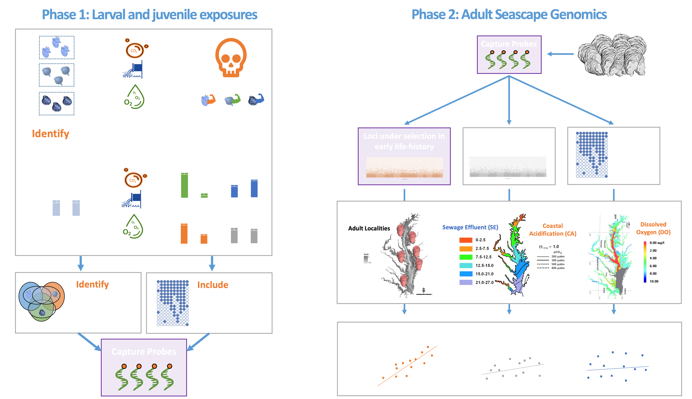

Marine species face a complex suite of stressors that span multiple temporal and spatial scales from long-term global ocean change to localized episodes of coastal acidification. The cumulative and concurrent impacts of multiple stressors remain relatively unknown and requires investigating their synergistic impacts across all life stages. Two common stressors in coastal environments are hypoxia, or low dissolved oxygen (LDO), and coastal acidification (CA). Hypoxia and coastal acidification are linked to daily cycles of respiration and photosynthesis, even in pristine bays and estuaries. 

The Puritz lab has two concurrent projects that look at the interaction of CA and LDO with other coastal stressors.  One, funded by the National Science Foundation looks at the interaction of LDO, CA, and low salinity pulses.  Coastal waters are also affected by pulses of natural and artificial freshwater runoff driven by rainfall and storm events. Pulses of freshwater can cause short-term, low salinity conditions, another stressor, that are expected to worsen with climate change. 

Our second project, funded by RI Sea Grant, looks at the CA, LDO, and sewage effluent, a common source of eutrophication in many urbanized estuaries.  

For many marine species, larval stages are the only means of migration and genetic exchange, and larvae are likely encountering hypoxia, coastal acidification, and low salinity stressors while they are in shallow coastal waters. Additionally, early juveniles may encounter extended periods of all three stressors. The interaction of early life-history stages with repeated and combinations of coastal stressors has the potential to result in an increase of larval/juvenile mortality or the removal of less tolerant larvae. The consequences of this differential mortality are being investigated in the eastern oyster using laboratory multi-stressor exposure experiments and in the field through genomic surveys of natural populations. Patterns of genetic selection are being analyzed by combining genomic and environmental data to elucidate how multiple stressors are shaping marine populations.

Both projects take a two phase framework:

Phase 1 will determine how larval and juvenile genotypes and phenotypes respond to multiple stressors across different developmental time points. This will be done with two larval short-term exposures to factorial combinations of DO/CA and LS and a long-term juvenile exposure to factorial combinations of DO/CA diurnal cycling and LS.  A cost-effective exome capture method will be used to sequence the coding sequences of genes expressed during exposures. Phase 1 will (i) characterize how multiple stressors affect larval growth, respiration, and survival, (ii) how allele frequencies in larval and juvenile pools respond to multiple stressors across three different life-history stages and (iii) if specific alleles convey higher survival. 

Phase 2 will determine the role of natural and anthropogenic forces shaping the evolution of oyster populations by testing (i) if selective regimes differ and interact across life-history stages and (ii) if the frequencies of both neutral and resistant genotypes correlate to environmental conditions and if adaptive loci partitioned across life stage. Environmental data will be integrated into a seascape genomics framework using panel of genomic markers, including potential loci under selection during early-life history to survey the genome of adult populations across 24 localities from four urbanized estuaries.  

