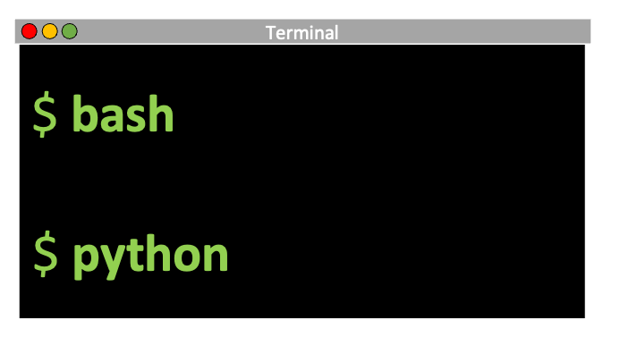

---
# An instance of the Portfolio widget.
# Documentation: https://wowchemy.com/docs/page-builder/
widget: portfolio

# This file represents a page section.
headless: TRUE

# Order that this section appears on the page.
weight: 30

title: |
    

      Bioinformatics 
    
 
subtitle: |
    

      
      

        As genomic scale data sets become standard in molecular ecology, understanding how to efficiently and accurately process raw data is critical for accuracy in downstream population-level analysis.  Current research focuses on RADseq bioinformatics and developing "reference-free" methods for exome captured data analysis.
      

    
   

content:
  # Page type to display. E.g. project.
  page_type: project

  # Default filter index (e.g. 0 corresponds to the first `filter_button` instance below).
  filter_default: 0

  # Filter toolbar (optional).
  # Add or remove as many filters (`filter_button` instances) as you like.
  # To show all items, set `tag` to "*".
  # To filter by a specific tag, set `tag` to an existing tag name.
  # To remove the toolbar, delete the entire `filter_button` block.
  filter_button:
  - name: Expressed Exome Capture Sequencing
    tag: EecSeqBio
  - name: Eastern Oyster Genome
    tag: EOG
  - name: dDocent
    tag: dDocent

        
design:
  # Choose how many columns the section has. Valid values: '1' or '2'.
  columns: '1'

  # Toggle between the various page layout types.
  #   1 = List
  #   2 = Compact
  #   3 = Card
  #   5 = Showcase
  view: 5

  # For Showcase view, flip alternate rows?
  flip_alt_rows: True
---
