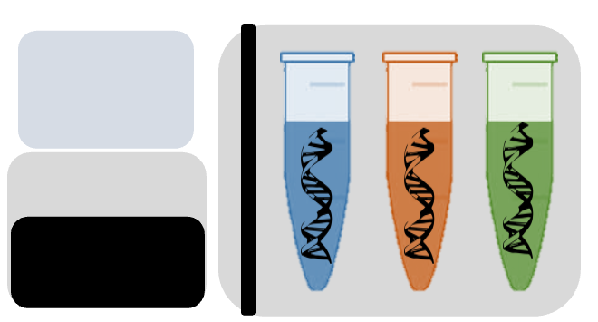

---
# An instance of the Portfolio widget.
# Documentation: https://wowchemy.com/docs/page-builder/
widget: portfolio

# This file represents a page section.
headless: TRUE

# Order that this section appears on the page.
weight: 20

title: "Next-generation Sequencing"
subtitle: |
    

      

        
      

      

        The advent of next-generation sequencing (NGS) has rapidly transcended population genetics to population genomics. Current research focuses on adopting next-generation sequencing technology and embracing an ever-adapting genomic toolkit to take advantage of this unprecedented amount of genetic data.
      

    
    

content:
  # Page type to display. E.g. project.
  page_type: project

  # Default filter index (e.g. 0 corresponds to the first `filter_button` instance below).
  filter_default: 0

  # Filter toolbar (optional).
  # Add or remove as many filters (`filter_button` instances) as you like.
  # To show all items, set `tag` to "*".
  # To filter by a specific tag, set `tag` to an existing tag name.
  # To remove the toolbar, delete the entire `filter_button` block.
  filter_button:
  - name: Expressed Exome Capture Sequencing
    tag: EecSeq
  - name: Eastern Oyster Genome
    tag: EOG
  - name: Eastern Oyster SNP Array
    tag: SNP Array

        
design:
  # Choose how many columns the section has. Valid values: '1' or '2'.
  columns: '1'

  # Toggle between the various page layout types.
  #   1 = List
  #   2 = Compact
  #   3 = Card
  #   5 = Showcase
  view: 5

  # For Showcase view, flip alternate rows?
  flip_alt_rows: True
---

