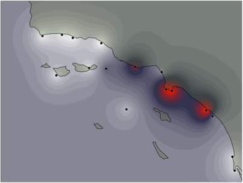

---
# An instance of the Portfolio widget.
# Documentation: https://wowchemy.com/docs/page-builder/
widget: portfolio

# This file represents a page section.
headless: TRUE

# Order that this section appears on the page.
weight: 50

title: |
    

      Selection
    
 
subtitle: |
    

      
      

       We determine the role of natural and anthropogenic forces shaping the evolution of marine populations by testing (i) if selective regimes differ and interact across life-history stages and (ii) if the frequencies of both neutral and resistant genotypes correlate to environmental conditions and if adaptive loci partitioned across life stage. Environmental data are integrated into a seascape genomics framework using panel of genomic markers, including potential loci under selection during early-life history to survey the genome of adult populations across urbanized estuaries.  
      

    
   

content:
  # Page type to display. E.g. project.
  page_type: project

  # Default filter index (e.g. 0 corresponds to the first `filter_button` instance below).
  filter_default: 0

  # Filter toolbar (optional).
  # Add or remove as many filters (`filter_button` instances) as you like.
  # To show all items, set `tag` to "*".
  # To filter by a specific tag, set `tag` to an existing tag name.
  # To remove the toolbar, delete the entire `filter_button` block.
  filter_button:
  - name: Coastal Stressors
    tag: Coastal_Stressors_SG
  - name: pH, DO, and sewage effluent across Narragansett Bay
    tag: NB
 
design:
  # Choose how many columns the section has. Valid values: '1' or '2'.
  columns: '1'

  # Toggle between the various page layout types.
  #   1 = List
  #   2 = Compact
  #   3 = Card
  #   5 = Showcase
  view: 5

  # For Showcase view, flip alternate rows?
  flip_alt_rows: True
---
